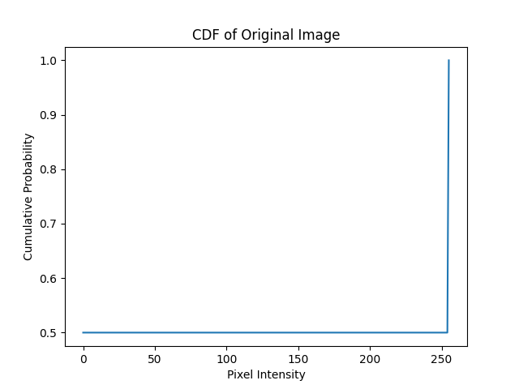
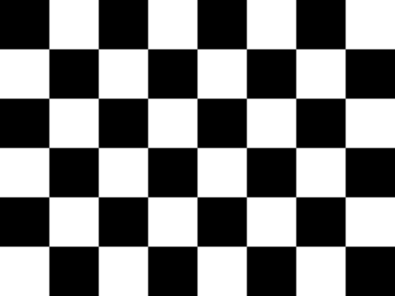
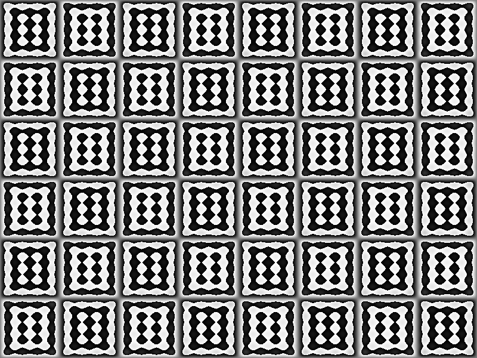
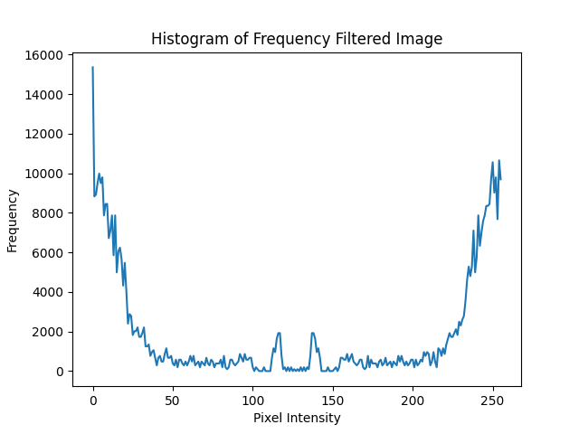
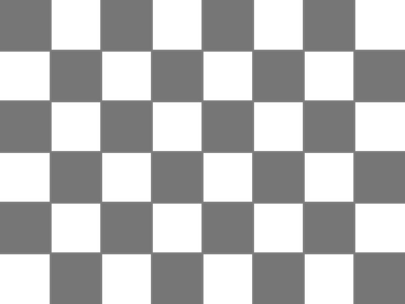
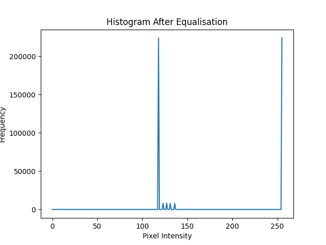

# Assignment 1 – AIML331 2025  
**Name:** Khai Dye-Brinkman  
**Student ID:** 300550065  
**Date:** April 03, 2025  
**Code Repository:** [https://github.com/KhaiShea/aiml331-assignment1](https://github.com/KhaiShea/aiml331-assignment1)

---

## 1. Camera Problem

### 1.1 [R, t] Matrix

> Your pinhole camera is at [X, Y, Z] = [0, 0, −10] and sits on a horizontal table (X and Z specify the horizontal plane). It is pointing 30 degrees to the right relative to the origin of the world coordinates. Compute the [R, t] matrix converting world coordinates to camera coordinates. [5 marks]

```python
import numpy as np

theta = np.radians(30)
R = np.array([
    [np.cos(theta), 0, np.sin(theta)],
    [0, 1, 0],
    [-np.sin(theta), 0, np.cos(theta)]
])
C = np.array([0, 0, -10])
t = -R @ C
Rt = np.column_stack((R, t))
print("R =\n", R)
print("t =\n", t)
print("[R|t] =\n", Rt)
```

### 1.2 Line in Projective Plane

> Your camera has f = 0.1 (focal length, as used in pinhole camera). Using homogeneous coordinates compute the equation of a line on the projective plane that goes through the points that correspond to [0, 1, 0] and [0, 0, 1] in the world coordinates. [10 marks]

```python
f = 0.1
K = np.array([
    [f, 0, 0],
    [0, f, 0],
    [0, 0, 1]
])
X1 = np.array([0, 1, 0, 1])
X2 = np.array([0, 0, 1, 1])
P1 = K @ Rt @ X1
P2 = K @ Rt @ X2
P1 /= P1[2]
P2 /= P2[2]
line = np.cross(P1, P2)
print("Line (homogeneous):", line)
```

---

## 2. Checkerboard Problem

### 2.1 Find Checkerboard Image

> Find an image on-line that displays a checkerboard (provide source website). [1 mark]

Image: https://upload.wikimedia.org/wikipedia/commons/3/3c/Checkerboard_pattern.png

### 2.2 Histogram and Cumulative Probability Function

```python
img = cv2.imread("images/checkerboard.png", cv2.IMREAD_GRAYSCALE)
hist = cv2.calcHist([img], [0], None, [256], [0, 256])
cdf = hist.cumsum() / hist.sum()

plt.plot(cdf)
plt.title("CDF of Original Image")
plt.savefig("images/cdf.png")
```



---

### 2.3 Spatial Low-pass Filter

```python
blurred = cv2.GaussianBlur(img, (5, 5), 1.0)
cv2.imwrite("images/blurred.png", blurred)
```



---

### 2.4 Separable Filter?

Yes — the Gaussian filter is separable.

---

### 2.5 Frequency Domain Low-pass Filter

```python
f = np.fft.fft2(img)
fshift = np.fft.fftshift(f)
rows, cols = img.shape
crow, ccol = rows // 2, cols // 2
mask = np.zeros_like(img)
mask[crow-30:crow+30, ccol-30:ccol+30] = 1
filtered_fshift = fshift * mask
f_ishift = np.fft.ifftshift(filtered_fshift)
filtered_img = np.fft.ifft2(f_ishift).real.astype(np.uint8)
cv2.imwrite("images/frequency_filtered.png", filtered_img)
```



---

### 2.6 Histogram of Frequency Filtered Image

```python
filtered_hist = cv2.calcHist([filtered_img], [0], None, [256], [0, 256])
plt.plot(filtered_hist)
plt.title("Histogram of Frequency Filtered Image")
plt.savefig("images/frequency_histogram.png")
```



---

### 2.7 Histogram Equalisation using CDF

```python
blurred_hist = cv2.calcHist([blurred], [0], None, [256], [0, 256])
blurred_cdf = blurred_hist.cumsum() / blurred_hist.sum()
cdf_normalized = blurred_cdf * 255 / blurred_cdf[-1]

equalized = np.interp(blurred.flatten(), range(256), cdf_normalized).reshape(img.shape).astype(np.uint8)
cv2.imwrite("images/equalized.png", equalized)
```

#### Equalised Image:


#### Histogram After Equalisation:
```python
equalized_hist = cv2.calcHist([equalized], [0], None, [256], [0, 256])
plt.plot(equalized_hist)
plt.title("Histogram After Equalisation")
plt.savefig("images/equalized_histogram.png")
```


